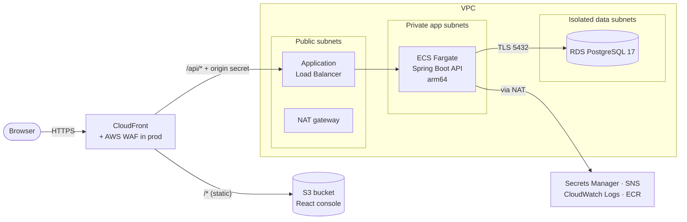
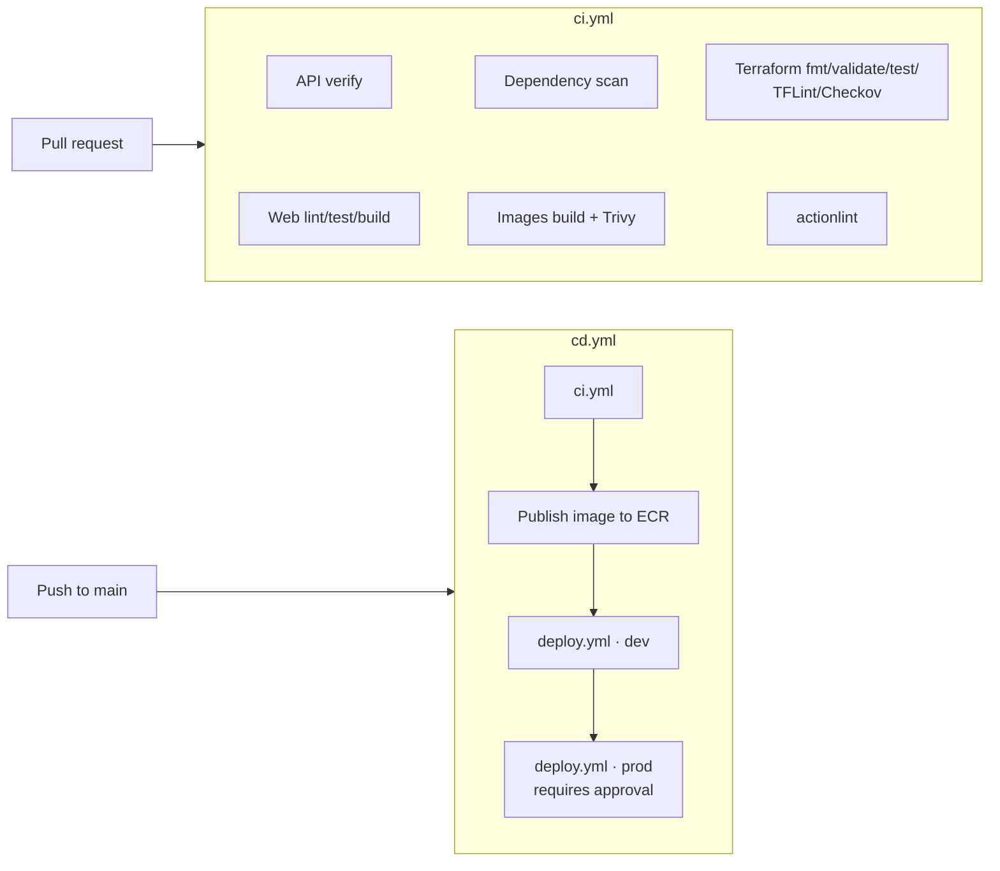

# CloudOps Platform

CloudOps Platform is an internal operations portal for engineering teams. It keeps a catalog of the
workloads each team runs, records every deployment, and manages incidents from the first alert to
resolution, with notifications for severe incidents.

The application is deliberately modest in scope. The engineering effort went into building,
testing, securing, containerising, provisioning and deploying it the way a production service
would be: a Java 25 / Spring Boot 4 API, a React console, PostgreSQL, Docker, Terraform-managed AWS
infrastructure, and GitHub Actions pipelines that authenticate to AWS through OIDC.

---

## Contents

- [Problem statement](#problem-statement)
- [Capabilities](#capabilities)
- [Architecture overview](#architecture-overview)
- [Technology stack](#technology-stack)
- [Repository structure](#repository-structure)
- [Local development](#local-development)
- [Testing and quality gates](#testing-and-quality-gates)
- [Docker](#docker)
- [Terraform and AWS](#terraform-and-aws)
- [CI/CD](#cicd)
- [Security practices](#security-practices)
- [Deployment workflow](#deployment-workflow)
- [Configuration](#configuration)
- [Troubleshooting](#troubleshooting)
- [Future improvements](#future-improvements)
- [Further documentation](#further-documentation)

---

## Problem statement

In many organisations, the answers to "who owns this service?", "what version is in production?"
and "is anything broken right now?" live in different places: a wiki page, a CI log, a chat
channel. During an incident that fragmentation costs time.

CloudOps Platform puts those answers in one place:

- every **workload** has an owning **team**, a criticality level, and links to its repository and runbook;
- every **deployment** to development, staging or production is recorded with its version, commit and outcome;
- every **incident** has a severity, a lifecycle (`OPEN → MITIGATED → RESOLVED`) and an append-only timeline;
- an **overview** derives the current health of each workload from its active incidents.

## Capabilities

| Area | What it does |
|---|---|
| Identity | Registration, password login issuing signed JWT access tokens, password change, role administration (`VIEWER`, `OPERATOR`, `ADMIN`, hierarchical) |
| Catalog | Teams and workloads with immutable slugs, criticality, HTTPS repository/runbook links |
| Deployments | Deployment history per workload and environment; latest production release per workload |
| Incidents | Open, update, mitigate, reopen and resolve incidents; severity reclassification; enforced lifecycle rules; full timeline with authors |
| Overview | Health per workload (`OPERATIONAL`, `DEGRADED`, `PARTIAL_OUTAGE`, `MAJOR_OUTAGE`), active incident count, last production release |
| Notifications | Incidents at or above a configurable severity publish to Amazon SNS after the transaction commits |
| Operations | Liveness/readiness probes, build/release endpoint used by the pipeline, structured JSON logs with request correlation IDs |

## Architecture overview



- **One public entry point.** CloudFront serves the console from a private S3 bucket and routes
  `/api/*` to the load balancer. Browser and API share an origin, so there is no CORS configuration.
- **The load balancer cannot be bypassed.** Its security group admits only CloudFront's
  origin-facing address ranges, and its listener forwards only requests carrying a secret header
  that CloudFront adds.
- **Three network tiers.** Tasks run in private subnets without public IPs; the database sits in
  subnets with no route to the internet and accepts connections only from the API security group.
- **Modular monolith.** The API is one deployable with enforced internal module boundaries. The
  rationale for not splitting it into microservices is in [docs/ARCHITECTURE.md](docs/ARCHITECTURE.md#why-a-modular-monolith).

## Technology stack

| Layer | Technology |
|---|---|
| API | Java 25, Spring Boot 4.1 (Web MVC, Security / OAuth2 Resource Server, Data JPA, Validation, Actuator), Hibernate 7, Flyway, springdoc-openapi, AWS SDK for Java v2 (SNS) |
| Database | PostgreSQL 17 (Amazon RDS in AWS) |
| Console | React 19, React Router, TypeScript, Vite |
| Testing | JUnit 5, AssertJ, Mockito, Spring MockMvc, ArchUnit, embedded PostgreSQL, JaCoCo, SpotBugs; Vitest and Testing Library; `terraform test` with mocked providers |
| Containers | Multi-stage Dockerfiles, Eclipse Temurin JRE (Alpine), unprivileged nginx, Docker Compose |
| Infrastructure | Terraform ≥ 1.11, AWS provider 6.x, S3 remote state with native locking |
| AWS | VPC, NAT gateway, ALB, ECS Fargate (Graviton), ECR, RDS, S3, CloudFront, CloudFront Functions, AWS WAF, ACM, Route 53 (optional), Secrets Manager, KMS, SNS, CloudWatch, IAM, Application Auto Scaling |
| CI/CD | GitHub Actions, OIDC federation to AWS, Trivy, Checkov, TFLint, CodeQL, Dependabot, actionlint |

## Repository structure

```text
.
├── api/                         Spring Boot API
│   ├── src/main/java/io/cloudops/platform/
│   │   ├── identity/            accounts, authentication, roles
│   │   ├── catalog/             teams and workloads
│   │   ├── deployments/         deployment history
│   │   ├── incidents/           incident lifecycle, health derivation, domain events
│   │   ├── notifications/       SNS / log notification channels
│   │   ├── overview/            read model composed from the other modules
│   │   └── shared/              security, error handling, web plumbing, base entities
│   ├── src/main/resources/db/migration/   Flyway migrations
│   └── Dockerfile
├── web/                         React console (Vite + TypeScript)
│   ├── src/{api,auth,components,hooks,lib,pages}
│   ├── nginx/                   nginx template for the local container
│   └── Dockerfile
├── infra/                       Terraform
│   ├── bootstrap/               one-time account setup: state bucket, ECR, GitHub OIDC roles
│   ├── modules/                 network, encryption, security-groups, database, load-balancer,
│   │                            ecs-service, edge, certificates, observability, container-registry
│   ├── environments/{dev,prod}/ backend settings and tfvars per environment
│   ├── tests/                   offline Terraform tests (mocked AWS provider)
│   └── main.tf, variables.tf, outputs.tf, providers.tf, versions.tf
├── .github/
│   ├── workflows/               ci.yml, cd.yml, deploy.yml, codeql.yml
│   ├── actions/terraform-init/  composite action shared by deployments
│   └── dependabot.yml
├── scripts/verify-deployment.sh post-deployment checks against the public URL
├── compose.yaml                 local production-like stack
└── docs/                        architecture, deployment, development, security, operations
```

## Local development

The quickest way to run everything is Docker Compose:

```bash
cp .env.example .env          # set POSTGRES_PASSWORD and CLOUDOPS_JWT_SECRET
docker compose up --build
```

| URL | What |
|---|---|
| http://localhost:3000 | Console (nginx serving the build and proxying `/api`) |
| http://localhost:8080/swagger-ui.html | Interactive API documentation |
| http://localhost:8080/actuator/health | Health |

Register with the address set in `CLOUDOPS_BOOTSTRAP_ADMIN_EMAIL` to become the first administrator.

To run the API on the JVM and the console on the Vite dev server instead, see
[docs/DEVELOPMENT.md](docs/DEVELOPMENT.md).

## Testing and quality gates

```bash
cd api && ./mvnw verify       # compile (-Werror), unit + integration tests, coverage gate, SpotBugs
cd web && npm ci && npm run lint && npm run typecheck && npm test && npm run build
cd infra && terraform init -backend=false && terraform validate && terraform test
```

| Suite | Count | What it covers |
|---|---|---|
| API unit and web-slice tests | 54 | Incident lifecycle and health rules, account and token services, notification policy, SNS publishing, HTTP security rules, validation errors, problem responses, module boundaries (ArchUnit) |
| API integration tests | 12 | Full application over HTTP against a real PostgreSQL 17 server: Flyway migration, Hibernate schema validation, role enforcement, incident workflow, deployment history, constraint handling |
| Console tests | 20 | API client and error mapping, session handling, login, role-dependent UI, incident updates with valid transitions |
| Terraform tests | 8 | Database privacy, encryption and TLS enforcement, security-group paths, subnet isolation, origin protection, input validation |

The API build fails below 80 % line coverage (currently about 95 %).

## Docker

| Image | Base | Notes |
|---|---|---|
| `api/Dockerfile` | `eclipse-temurin:25-jre-alpine` | Maven build stage runs on the build host's architecture; runtime stage is built for `linux/arm64`. Spring Boot layered extraction, non-root user `10001`, RDS CA bundle for certificate verification, `HEALTHCHECK` on the liveness probe |
| `web/Dockerfile` | `nginxinc/nginx-unprivileged:1.31-alpine` | Static build served as uid 101 with security headers; proxies `/api` to the API container. Used locally; in AWS the same build is served from S3 through CloudFront |

`compose.yaml` runs both images read-only, with all Linux capabilities dropped and
`no-new-privileges`, and binds ports to `127.0.0.1` only.

## Terraform and AWS

Infrastructure is split into two Terraform roots:

1. **`infra/bootstrap`** — applied once per AWS account with administrator credentials. Creates the
   encrypted, versioned state bucket, the shared ECR repository, the GitHub OIDC provider and the
   pipeline's IAM roles.
2. **`infra/`** — the environment stack, applied by the pipeline for `dev` and `prod` from
   `infra/environments/<env>/terraform.tfvars`.

| | dev | prod |
|---|---|---|
| Availability zones | 2 | 3 |
| NAT gateways | 1 (shared) | 1 per AZ |
| API tasks (autoscaling) | 1–2 × 0.5 vCPU / 1 GiB | 2–6 × 1 vCPU / 2 GiB |
| RDS | `db.t4g.micro`, single-AZ, 3-day backups | `db.t4g.medium`, Multi-AZ, 14-day backups |
| AWS WAF | off | on |
| Deletion protection | off | on |
| Log retention | 14 days | 90 days |

A custom domain is optional. Without one, the platform is served at the CloudFront hostname; with
`domain_name` and `hosted_zone_id`, Terraform issues ACM certificates and the CloudFront-to-ALB hop
also uses HTTPS. Details: [docs/DEPLOYMENT.md](docs/DEPLOYMENT.md).

> Applying the stack creates billable resources. The NAT gateway, load balancer and RDS instance run
> continuously; destroy the dev environment when you are not using it.

## CI/CD



- **`ci.yml`** validates every pull request: API build and tests, console checks, dependency and
  container vulnerability scans, Terraform quality and security checks, and workflow linting.
- **`cd.yml`** runs on `main`: it calls `ci.yml`, pushes the exact image archive that was scanned to
  ECR (tagged with the commit SHA), deploys to dev, verifies, and then deploys the same image to prod
  once the prod environment's reviewers approve.
- **`deploy.yml`** is the reusable per-environment deployment: Terraform plan and apply (which rolls
  out the new ECS task definition and waits for healthy tasks), console upload to S3, CloudFront
  invalidation, and verification through the public URL.
- **`codeql.yml`** runs CodeQL for Java and TypeScript on pull requests, `main` and weekly.

No AWS access keys are stored in GitHub: jobs exchange a GitHub OIDC token for short-lived role
credentials, and each role's trust policy is pinned to this repository and to either the `main`
branch or a specific GitHub environment.

## Security practices

A summary; [docs/SECURITY.md](docs/SECURITY.md) lists every control and its location.

- HTTPS for viewers (CloudFront redirect + HSTS); TLS 1.2+ origin policy when a domain is configured; TLS required by PostgreSQL (`rds.force_ssl`) and verified by the API (`sslmode=verify-full`).
- Stateless JWT authentication (HS256, issuer and audience validated, 1 hour lifetime); BCrypt password hashing; role-based authorisation on every mutating endpoint.
- Input validation on every request body and query parameter; RFC 9457 problem responses that never include stack traces.
- Secrets generated by Terraform as ephemeral values and written to Secrets Manager through write-only arguments, so they never appear in Terraform state; injected into tasks by ECS.
- Customer-managed KMS key per environment for RDS, Secrets Manager, CloudWatch Logs, SNS and the site bucket.
- Least-privilege task roles (the API may only publish to its incident topic), non-root read-only containers, private subnets, security groups that chain CloudFront → ALB → API → database.
- AWS WAF with managed rule groups and per-IP throttling of authentication endpoints (prod).
- Trivy (dependencies and images), Checkov and TFLint (Terraform), CodeQL (code), Dependabot (updates), all actions pinned to commit SHAs.

## Deployment workflow

1. Apply `infra/bootstrap` once with administrator credentials.
2. Configure the GitHub repository variables and the `dev` / `prod` environments with the role ARNs
   that bootstrap outputs (see [docs/DEPLOYMENT.md](docs/DEPLOYMENT.md#3-configure-github)).
3. Merge to `main`. The pipeline builds, scans, publishes, deploys dev, verifies, waits for
   approval, deploys prod and verifies again.
4. Register with the configured bootstrap administrator email on the deployed console.

## Configuration

API settings are environment variables; secrets have no defaults, so a misconfigured deployment
fails at startup instead of running insecurely.

| Variable | Required | Purpose |
|---|---|---|
| `SPRING_DATASOURCE_URL` / `_USERNAME` / `_PASSWORD` | yes | PostgreSQL connection |
| `CLOUDOPS_JWT_SECRET` | yes | Token signing key, at least 32 characters |
| `CLOUDOPS_BOOTSTRAP_ADMIN_EMAIL` | no | Account that becomes `ADMIN` on registration |
| `CLOUDOPS_ACCESS_TOKEN_TTL` | no | Token lifetime (default `1h`) |
| `CLOUDOPS_NOTIFICATION_CHANNEL` | no | `log` (default) or `sns` |
| `CLOUDOPS_INCIDENT_TOPIC_ARN` | with `sns` | Topic for incident notifications |
| `CLOUDOPS_NOTIFICATION_MIN_SEVERITY` | no | Least severe level that notifies (default `SEV2`) |
| `CLOUDOPS_RELEASE` | no | Release identifier reported by `/api/v1/platform/info` |
| `CLOUDOPS_API_DOCS_ENABLED` | no | Swagger UI and OpenAPI document (default `true`; disabled by the `aws` profile) |

In AWS, ECS sets all of these from Terraform outputs and Secrets Manager. The full list, including
GitHub variables, is in [docs/DEVELOPMENT.md](docs/DEVELOPMENT.md#configuration-reference) and
[docs/DEPLOYMENT.md](docs/DEPLOYMENT.md#3-configure-github).

## Troubleshooting

| Symptom | Likely cause and fix |
|---|---|
| API exits at startup with `cloudops.security.jwt.secret ... must be at least 32 characters` | `CLOUDOPS_JWT_SECRET` missing or too short. Generate one with `openssl rand -base64 48`. |
| `docker compose up` fails with `set POSTGRES_PASSWORD in .env` | Copy `.env.example` to `.env` and fill it in. |
| Console shows "Network error" | API not reachable: check `docker compose ps` or that the API listens on 8080 for the Vite proxy. |
| Every API call returns 401 after a while | The access token expired (1 hour by default); sign in again. |
| An operator action returns 403 | The account is still `VIEWER`; an administrator must assign `OPERATOR` on the Users page. |
| Deploy job fails at `Configure AWS credentials` | The role's trust policy does not match: check `github_repository` in bootstrap and that the job uses the `dev`/`prod` environment. |
| `terraform plan` fails with `api_image_tag must be a git commit SHA` | Pass the SHA of an image that exists in ECR: `-var api_image_tag=<sha>`. |
| Deployment verification times out | New tasks are failing health checks; see [docs/OPERATIONS.md](docs/OPERATIONS.md#a-deployment-fails). |

## Future improvements

- **Separate AWS accounts per environment** (AWS Organizations) with cross-account ECR pulls, instead of one account hosting both.
- **Narrower deploy permissions**: replace `PowerUserAccess` on the deploy roles with a service-scoped policy and an IAM permissions boundary.
- **Transactional outbox** for notifications, so an event survives a crash between commit and SNS publish.
- **Token revocation and refresh**: today a role change takes effect when the current token expires.
- **External identity provider** (Amazon Cognito or corporate SSO) via the existing resource-server configuration.
- **VPC interface endpoints** for ECR, Logs, Secrets Manager and SNS to remove NAT dependency for AWS API calls.
- **Scheduled drift detection** with a read-only plan role.
- **CloudFront standard logging** to a dedicated log bucket, and OpenTelemetry tracing.
- **End-to-end browser tests** (Playwright) against a deployed environment.

## Further documentation

| Document | Contents |
|---|---|
| [docs/ARCHITECTURE.md](docs/ARCHITECTURE.md) | Application design, domain model, request and authentication flows, AWS design decisions |
| [docs/DEPLOYMENT.md](docs/DEPLOYMENT.md) | Bootstrap, GitHub configuration, pipeline behaviour, manual Terraform usage, teardown |
| [docs/DEVELOPMENT.md](docs/DEVELOPMENT.md) | Local setup, configuration reference, tests, conventions |
| [docs/SECURITY.md](docs/SECURITY.md) | Security controls by layer, scanning, known limitations |
| [docs/OPERATIONS.md](docs/OPERATIONS.md) | Health checks, logs, metrics and alarms, runbooks |
