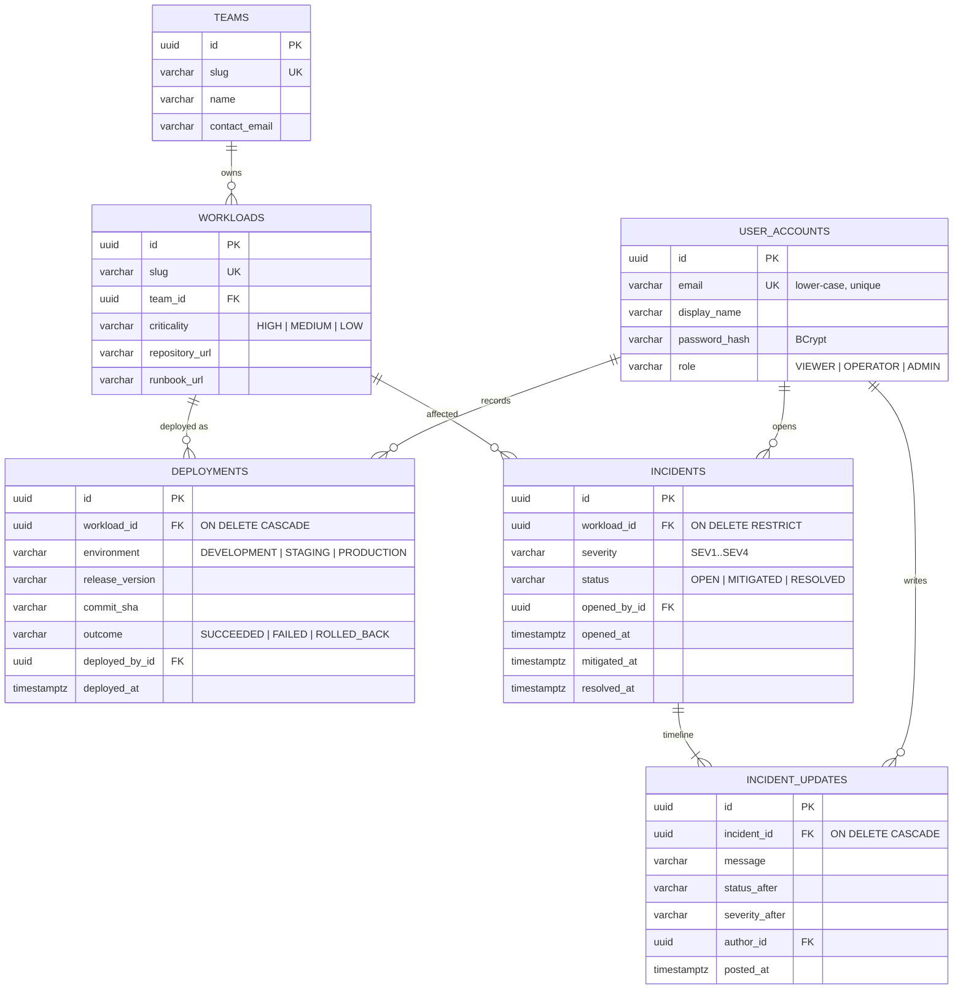
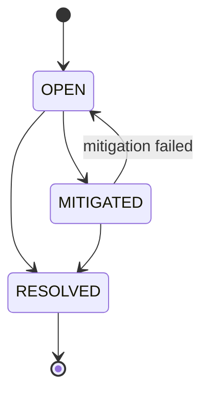
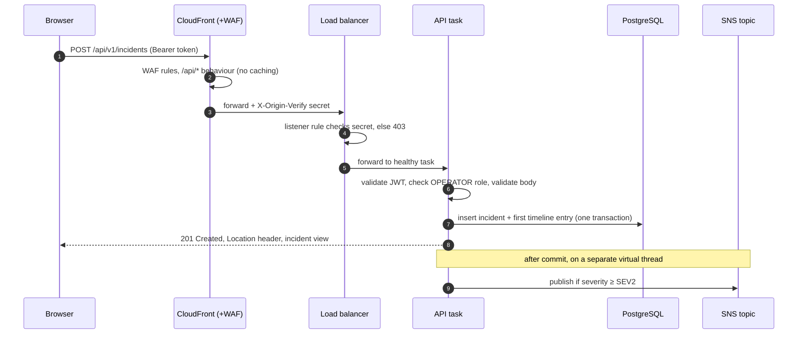
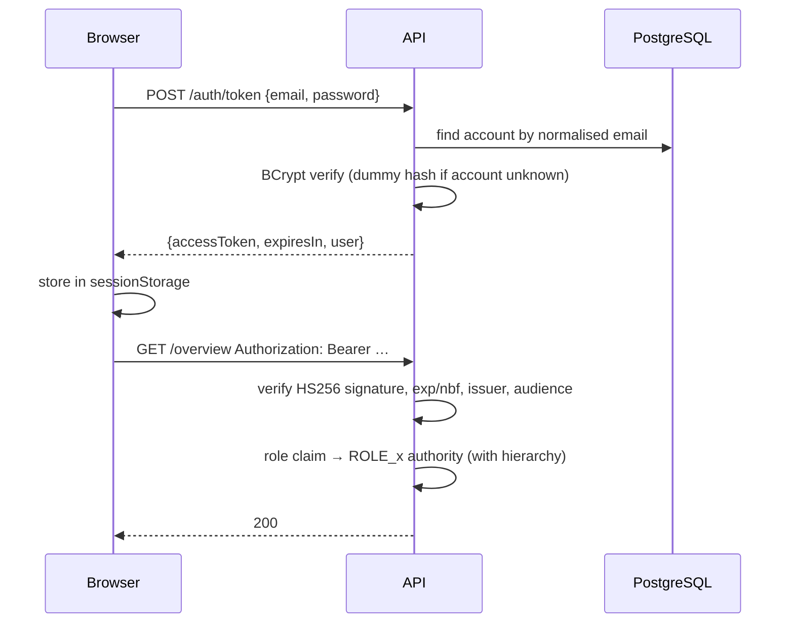
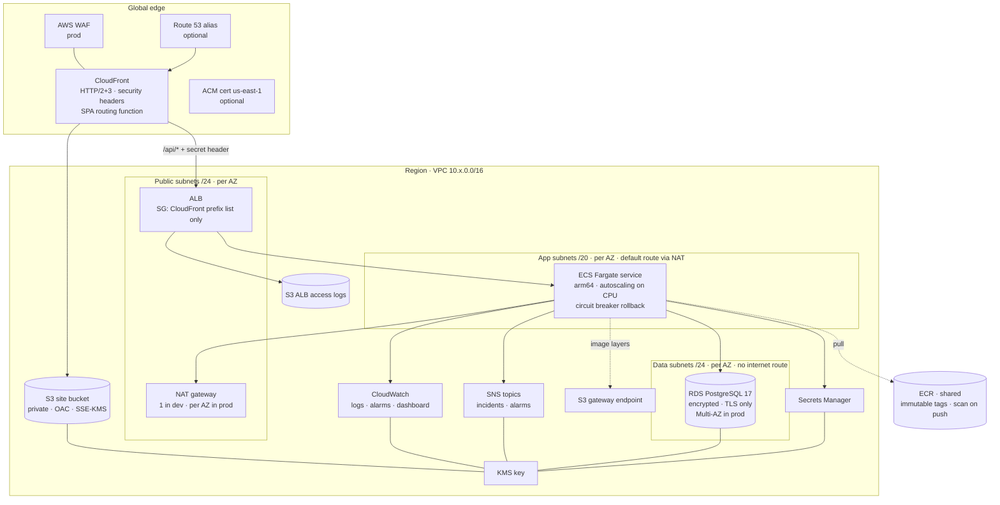

# Architecture

This document explains how CloudOps Platform is built and why. It covers the application, its data
model and request flows, the container images, and the AWS infrastructure defined in `infra/`.

- [1. Application architecture](#1-application-architecture)
- [2. Domain model and database](#2-domain-model-and-database)
- [3. API surface](#3-api-surface)
- [4. Request flow](#4-request-flow)
- [5. Authentication and authorisation](#5-authentication-and-authorisation)
- [6. Asynchronous notifications](#6-asynchronous-notifications)
- [7. Console](#7-console)
- [8. Container images](#8-container-images)
- [9. AWS architecture](#9-aws-architecture)
- [10. CI/CD](#10-cicd)
- [11. Secrets](#11-secrets)
- [12. Observability](#12-observability)
- [13. Security boundaries](#13-security-boundaries)

---

## 1. Application architecture

### Modules

The API (`api/`) is a single Spring Boot application divided into modules, one package each under
`io.cloudops.platform`:

| Module | Responsibility | Depends on |
|---|---|---|
| `identity` | Accounts, password hashing, token issuance, role administration | `shared` |
| `catalog` | Teams and workloads | `shared` |
| `deployments` | Deployment history per workload | `catalog`, `shared` |
| `incidents` | Incident lifecycle, timeline, workload health, domain events | `catalog`, `shared` |
| `notifications` | Reacts to incident events, delivers via SNS or the log | `incidents` (events and enums only) |
| `overview` | Read model for the dashboard; owns no data | `catalog`, `deployments`, `incidents` |
| `shared` | Security configuration, error handling, request correlation, base entities | — |

Inside a module, code is layered:

```
api/            HTTP adapters: controllers only (thin; no business logic)
application/    use-case services, command records (validated input), view records (output)
domain/         entities, enums and the business rules they enforce
persistence/    Spring Data repositories
events/         (incidents only) events other modules may consume
```

Controllers accept application-layer **commands** and return **views**. Entities never cross the
HTTP boundary, and lazy associations are resolved inside the service's transaction
(`spring.jpa.open-in-view` is off).

### Enforced boundaries

`ArchitectureTest` (ArchUnit) fails the build when:

- module packages form a dependency cycle;
- a controller depends on a repository;
- a class outside a module touches that module's `persistence` or `api` package, or any of its `@Entity` classes;
- the `shared` package depends on a business module.

Modules refer to each other's records **by id**. For example, `Deployment.workloadId` is a plain
UUID column with a database foreign key, not a JPA association to `Workload`. A module that needs
details about another module's data calls that module's application service (for example
`WorkloadService.reference(id)`).

### Why a modular monolith

Splitting identity, catalog, incidents and notifications into separate services was considered and
rejected for this system:

- **One team, one release cadence.** Independent deployability only pays off when different teams
  ship on different schedules.
- **Strongly related data.** Incidents and deployments reference workloads; the overview joins all
  three. Separate databases would replace foreign keys and simple queries with API calls and
  eventual consistency.
- **Operational cost.** Each service would need its own pipeline, task definition, scaling policy,
  alarms and network path, multiplying infrastructure without improving reliability at this scale.

The design keeps the seams that would make a later split straightforward: modules communicate
through application services and events, never through each other's tables or entities, and
the boundary rules are tested. Notifications are already decoupled through an event and an
external topic (SNS), which is the most natural first candidate for extraction.

### Cross-cutting behaviour

| Concern | Implementation |
|---|---|
| Errors | `ApiExceptionHandler` maps exceptions to RFC 9457 `application/problem+json` (404 not found, 409 conflict or concurrent modification, 422 business rule, 400 validation with a per-field `errors` array, 401/403, 500 without internals) |
| Validation | Jakarta Bean Validation on command records and on query parameters (page size capped at 100) |
| Concurrency | `@Version` optimistic locking on mutable aggregates; concurrent edits return 409 |
| Time | Business timestamps come from an injected `Clock` (UTC) |
| Identifiers | UUIDv7 generated by Hibernate: unguessable in URLs, roughly time-ordered for index locality |
| Threads | Virtual threads for request handling and asynchronous listeners |
| Correlation | `RequestCorrelationFilter` accepts a safe `X-Request-Id` or generates one, adds it to the log context (MDC) and echoes it in the response |

## 2. Domain model and database



Mutable tables also carry `version`, `created_at` and `updated_at`. Deployments and incident
updates are append-only (`@Immutable`) and store the actor's display name at the time of writing,
so history reads correctly even if a user is later renamed.

### Business rules

**Incident lifecycle** (`IncidentStatus`, enforced in `Incident.postUpdate`):



`RESOLVED` is terminal: a recurrence is a new incident, which keeps time-to-resolve accurate.
Resolving directly from `OPEN` also sets `mitigated_at`; reopening clears it.

**Workload health** (`WorkloadHealth.assess`) is derived, not stored: an open SEV1 means
`MAJOR_OUTAGE`, an open SEV2 `PARTIAL_OUTAGE`, an open SEV3/SEV4 or any mitigated incident
`DEGRADED`, and no active incidents `OPERATIONAL`. The worst active incident wins.

**Retention**: deleting a workload cascades to its deployment history but is refused (409) while it
has incidents, because incident history is audit data.

### Migrations and constraints

The schema is owned by Flyway (`api/src/main/resources/db/migration`). Hibernate only validates it
(`ddl-auto: validate`), so a mismatch between entities and migrations stops the application at
startup — and fails the integration tests, which run the real migration on PostgreSQL 17.

The database enforces the rules it can independently of the application: unique slugs and emails,
lower-case emails, enumerated values via `CHECK` constraints, commit SHA format,
`status = 'RESOLVED'` exactly when `resolved_at` is set, and chronological timestamps.

Indexes match the access paths:

| Index | Serves |
|---|---|
| `ix_deployments_workload_env_time (workload_id, environment, deployed_at DESC)` | Deployment history and the latest-per-environment lookup |
| `ix_incidents_status_opened`, `ix_incidents_workload_opened` | Incident list filters, newest first |
| `ix_incidents_active (workload_id) WHERE status <> 'RESOLVED'` | Health calculation, which only scans unresolved incidents |
| `ix_incident_updates_incident_time` | Timeline in order |

Connection pooling is HikariCP (10 connections per task by default, 5 s acquisition timeout,
30-minute maximum connection lifetime).

## 3. API surface

All endpoints are under `/api/v1`. An OpenAPI document and Swagger UI are generated by springdoc and
enabled outside AWS.

| Method and path | Role | Purpose |
|---|---|---|
| `POST /auth/register` | public | Create an account (`VIEWER`, or `ADMIN` for the bootstrap email) |
| `POST /auth/token` | public | Exchange credentials for an access token |
| `GET /users/me` · `PUT /users/me/password` | any | Own profile, change password |
| `GET /users` · `PUT /users/{id}/role` | ADMIN | List users, assign roles (not one's own) |
| `GET /teams` · `GET /teams/{id}` | any | Teams |
| `POST /teams` · `PUT /teams/{id}` | ADMIN | Create or update a team |
| `GET /workloads?teamId=` · `GET /workloads/{id}` | any | Catalog |
| `POST /workloads` · `PUT /workloads/{id}` | OPERATOR | Register or update a workload |
| `DELETE /workloads/{id}` | ADMIN | Remove a workload without incident history |
| `GET /workloads/{id}/deployments?environment=` | any | Deployment history, newest first |
| `POST /workloads/{id}/deployments` | OPERATOR | Record a deployment |
| `GET /incidents?status=&workloadId=` · `GET /incidents/{id}` | any | Incident list and detail with timeline |
| `POST /incidents` · `POST /incidents/{id}/updates` | OPERATOR | Open an incident, post an update or transition |
| `GET /overview` | any | Health, active incidents and last production release per workload |
| `GET /platform/info` | public | Service version and release (commit SHA) |

`ADMIN` implies `OPERATOR`, which implies `VIEWER`. Lists return a stable envelope:
`{ items, page, size, totalItems, totalPages }`.

## 4. Request flow

An operator opening an incident in production:



Static assets follow the default CloudFront behaviour to the private S3 bucket. A CloudFront
Function rewrites extension-less paths (client-side routes such as `/incidents/…`) to
`/index.html`; it is attached only to the static behaviour, so unknown API paths still return real
404 problem responses.

## 5. Authentication and authorisation



- Tokens are issued by the API itself (`AuthenticationService`) using Spring Security's
  `NimbusJwtEncoder` and validated by the standard OAuth2 resource-server filter. Claims: `sub`
  (user id), `email`, `name`, `role`, `iss`, `aud`, `iat`, `nbf`, `exp`, `jti`.
- Unknown accounts and wrong passwords return the same 401 and take similar time, because a dummy
  BCrypt comparison runs when the account does not exist.
- The authenticated caller reaches controllers as an `Actor` record built from verified claims, so
  most requests need no extra database lookup for identity.
- `@PreAuthorize` guards every mutating endpoint; administrators cannot change their own role.
- Sessions are stateless, so CSRF protection is disabled: tokens are sent in a header, never as
  cookies. The console keeps the token in `sessionStorage` and signs the user out on expiry or on
  any 401.
- The first administrator is designated by `CLOUDOPS_BOOTSTRAP_ADMIN_EMAIL` and chooses their own
  password at registration, so no credentials are seeded.

## 6. Asynchronous notifications

`IncidentService` publishes `IncidentOpenedEvent` and `IncidentUpdatedEvent` through Spring's
event bus. `IncidentNotificationListener` receives them with
`@TransactionalEventListener` + `@Async`:

- **after commit** — nobody is paged for an incident that was rolled back;
- **asynchronously** — SNS latency never slows the API response.

It notifies when an incident at or above `CLOUDOPS_NOTIFICATION_MIN_SEVERITY` opens, changes
status, or escalates in severity; plain comments do not notify. The channel is selected by
configuration: `SnsIncidentNotifier` in AWS (messages carry `severity` and `eventType` attributes for
SNS subscription filter policies), `LoggingIncidentNotifier` locally. Delivery failures are logged,
not propagated.

Trade-off: an event is held in memory between commit and publish, so a crash in that window loses
the notification. A transactional outbox would close that gap (listed under future improvements).

## 7. Console

The console (`web/`) is a React single-page application built with Vite and TypeScript.

| Folder | Contents |
|---|---|
| `api/` | Typed API contracts, a `fetch` wrapper that adds the bearer token and turns problem responses into `ApiError`, and endpoint functions |
| `auth/` | Session storage, `AuthProvider`/`useAuth`, role hierarchy helper, `RequireAuth` route guard |
| `hooks/` | `useApi` (loading/error/reload, ignores stale responses) and `useAction` (mutations with pending/error state) |
| `pages/` | Overview, workload detail, incident list and detail, teams, users, account, login, registration |

The console always calls relative `/api/v1/...` URLs, so one build works locally (Vite or nginx
proxy) and in every AWS environment (CloudFront routing) without environment-specific configuration.
Role checks in the UI only hide controls; the API enforces every rule.

## 8. Container images

**API** (`api/Dockerfile`)

1. Build stage `eclipse-temurin:25-jdk-noble`, pinned to the build machine's architecture: resolves
   dependencies in a cached layer, packages the JAR, extracts Spring Boot layers, and downloads the
   Amazon RDS CA bundle.
2. Runtime stage `eclipse-temurin:25-jre-alpine` for `linux/arm64`: updated packages, dedicated user
   `10001`, layers copied from least to most frequently changing, the CA bundle, a `HEALTHCHECK`
   against `/actuator/health/liveness`, and JVM flags that size the heap from the container limit and
   exit on out-of-memory errors.

No build tools, sources or secrets reach the runtime image. In ECS the root filesystem is read-only
with an ephemeral `/tmp` volume.

**Console** (`web/Dockerfile`): Node 24 builds the bundle; `nginx-unprivileged` serves it as uid 101
on port 8080 with security headers, long-lived caching for fingerprinted assets, no caching for
`index.html`, and an `/api/` reverse proxy. This image is for local use; AWS serves the bundle from S3.

## 9. AWS architecture



### Networking

| Tier | CIDR (dev) | Route to internet | Contains |
|---|---|---|---|
| Public | `10.40.0.0/24`, `10.40.1.0/24` | Internet gateway | ALB, NAT gateway |
| App | `10.40.16.0/20`, `10.40.32.0/20` | NAT gateway | ECS task ENIs (no public IPs) |
| Data | `10.40.200.0/24`, `10.40.201.0/24` | none | RDS |

Prod uses `10.50.0.0/16` across three zones with a NAT gateway per zone, so losing one zone does not
remove egress from the others. An S3 gateway endpoint lets image layer downloads from ECR bypass the
NAT gateway. VPC flow logs (rejected traffic by default) go to an encrypted CloudWatch log group,
and the default security group is stripped of all rules.

### Load balancing

The ALB lives in public subnets but its security group accepts only the AWS-managed
`com.amazonaws.global.cloudfront.origin-facing` prefix list. Its listener's default action is a
fixed 403; a single rule forwards to the API target group only when the `X-Origin-Verify` header
matches a random secret that Terraform also configures on the CloudFront origin. Without a custom
domain the CloudFront-to-ALB hop is HTTP on port 80 (CloudFront still enforces HTTPS for viewers);
with a domain, the ALB presents an ACM certificate for `origin.<domain>` and uses the
`ELBSecurityPolicy-TLS13-1-2-2021-06` policy, and CloudFront connects with `https-only`.

Other settings: invalid header fields dropped, access logs to S3 (lifecycle-expired), target health
checks on `/actuator/health/readiness` every 15 seconds, 30-second deregistration delay.

### Compute

- ECS Fargate service on **Graviton (ARM64)** in the app subnets, no public IPs.
- Rolling deployment with 100 % minimum healthy and 200 % maximum, so capacity never drops; the
  **deployment circuit breaker** rolls back automatically if new tasks never become healthy.
- Terraform waits for the service to reach a steady state, so a successful apply means healthy tasks.
- Target-tracking autoscaling keeps average CPU around 60 % between the environment's minimum and maximum.
- Container: read-only root filesystem, explicit non-root user, ephemeral `/tmp`, health check on liveness.
- Container Insights enabled on the cluster.

### Database

RDS PostgreSQL 17 on `gp3` storage with autoscaling, encrypted with the environment's KMS key, in
the isolated data subnets with `publicly_accessible = false`. A parameter group sets
`rds.force_ssl = 1` and logs slow statements (> 1 s), connections and disconnections; PostgreSQL
logs are exported to CloudWatch. Automated backups with point-in-time recovery, Performance
Insights, and Enhanced Monitoring are enabled. In prod: Multi-AZ, deletion protection, and a final
snapshot on destroy.

### CDN and frontend delivery

CloudFront has two origins:

| Behaviour | Origin | Caching | Notes |
|---|---|---|---|
| default `/*` | S3 via Origin Access Control | `Managed-CachingOptimized` | SPA routing function on viewer request; `redirect-to-https` |
| `/api/*` | ALB with origin secret header | custom policy, effectively no caching; `Authorization` forwarded | `https-only`; all methods allowed |

A response headers policy adds HSTS (two years, include subdomains), `X-Content-Type-Options`,
`X-Frame-Options: DENY`, a referrer policy and a content security policy (the API's own stricter
CSP is kept). The bucket blocks all public access and its policy only allows `s3:GetObject` from
this distribution, plus a TLS-only deny. In prod an AWS WAF web ACL applies the AWS Common and
Known Bad Inputs managed rule groups and blocks clients exceeding 100 authentication requests per
5 minutes.

### Terraform organisation

```
infra/
├── bootstrap/           account foundation, applied once, local → remote state
├── main.tf              composes the modules for one environment
├── modules/
│   ├── network/         VPC, subnets, NAT, routes, flow logs, S3 endpoint
│   ├── encryption/      environment KMS key and key policy
│   ├── security-groups/ every allowed network path, in one place
│   ├── database/        RDS, parameter group, credentials secret, monitoring role
│   ├── load-balancer/   ALB, listeners, origin-secret rule, access log bucket
│   ├── ecs-service/     cluster, task definition, service, IAM roles, JWT secret, incident topic, autoscaling
│   ├── edge/            site bucket, CloudFront, response headers, SPA function, WAF
│   ├── certificates/    ACM certificates and DNS validation (only with a domain)
│   ├── observability/   alarm topic, CloudWatch alarms, dashboard
│   └── container-registry/  ECR repository and lifecycle (used by bootstrap)
├── environments/{dev,prod}/  backend key and variable values
└── tests/               terraform test with mocked AWS provider
```

Every resource name is prefixed with `cloudops-<environment>`, and the provider applies default tags
`Project`, `Environment` and `ManagedBy`. State is stored per environment in the bootstrap bucket
with S3-native locking (`use_lockfile`), so no DynamoDB table is needed.

## 10. CI/CD

The pipeline is described step by step in [DEPLOYMENT.md](DEPLOYMENT.md#5-what-the-pipeline-does).
The design principles:

- **Same gates for pull requests and releases** — `cd.yml` calls `ci.yml` rather than duplicating it.
- **Build once, promote the same artefact** — the image archive scanned in CI is the one pushed to
  ECR; dev and prod run the same immutable tag (the commit SHA).
- **Terraform is the deployment mechanism** — the image tag is a Terraform variable, so
  infrastructure and application changes go through one reviewed plan and the state always
  describes what runs.
- **Verification from the outside** — the deployment is not considered done until the public URL
  reports the new release and basic security properties hold.
- **No long-lived credentials** — GitHub OIDC with roles pinned to the repository and to a branch or
  environment.

## 11. Secrets

| Secret | Created by | Stored in | Consumed by |
|---|---|---|---|
| Database master credentials | Terraform `ephemeral "random_password"` | Secrets Manager (KMS) via `secret_string_wo`; RDS via `password_wo` | ECS injects `SPRING_DATASOURCE_USERNAME` / `PASSWORD` |
| JWT signing key | Terraform `ephemeral "random_password"` | Secrets Manager (KMS) via `secret_string_wo` | ECS injects `CLOUDOPS_JWT_SECRET` |
| CloudFront origin secret | Terraform `random_password` | Terraform state, CloudFront origin config, ALB rule | CloudFront and ALB |

Write-only arguments (Terraform 1.11+) mean the database password and signing key never appear in
plans or state. They are rotated by incrementing `db_password_version` or `jwt_secret_version`. The
origin secret does live in state, which is acceptable because it is also visible to anyone who can
read the CloudFront and ALB configuration; the state bucket is private and KMS-encrypted.

Locally, secrets come from a git-ignored `.env` file. Nothing secret is committed, baked into an
image, or passed as a plain environment variable in the task definition.

## 12. Observability

- **Logs** — in AWS the `aws` profile switches to Elastic Common Schema JSON on stdout, shipped by
  the `awslogs` driver to `/ecs/cloudops-<env>/api`; each line carries the request id.
- **Health** — `/actuator/health/liveness` (container and ECS health check) and
  `/actuator/health/readiness` (includes the database; used by the ALB). Details are never exposed.
- **Metrics and alarms** — see [OPERATIONS.md](OPERATIONS.md#metrics-alarms-and-dashboard); alarms
  publish to an encrypted SNS topic with optional email subscribers.
- **Release identity** — `/api/v1/platform/info` returns the build version and commit SHA.

## 13. Security boundaries

| Boundary | Enforcement |
|---|---|
| Internet → platform | CloudFront only; WAF in prod; HTTPS for viewers |
| Internet → ALB | Security group (CloudFront prefix list) + origin secret header |
| ALB → API | Security group referencing the ALB group, port 8080 only |
| API → database | Security group referencing the API group, port 5432 only; TLS required and verified |
| Database → internet | No route exists |
| API → AWS | Task role allows only `sns:Publish` on the incident topic (and KMS use for it) |
| ECS agent → secrets | Execution role may read only the two application secrets |
| Caller → API operations | JWT validation and role hierarchy on every endpoint |
| CI → AWS | OIDC roles: image publishing from `main`; deployment per GitHub environment |

See [SECURITY.md](SECURITY.md) for the complete control list and known limitations.
